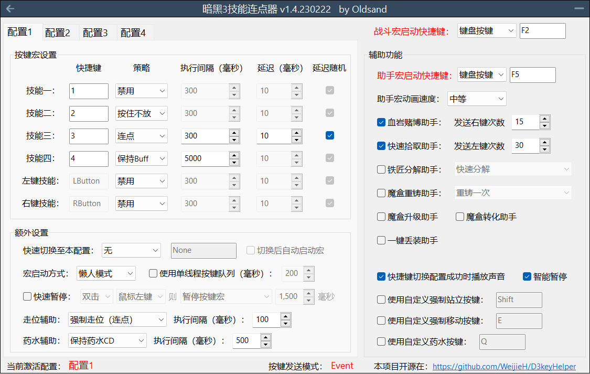
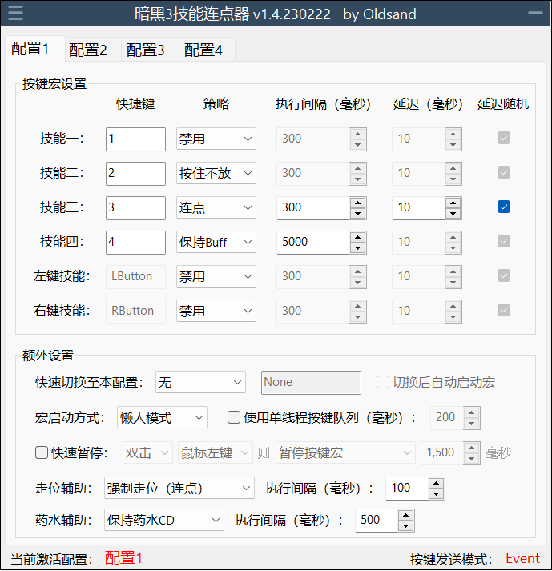
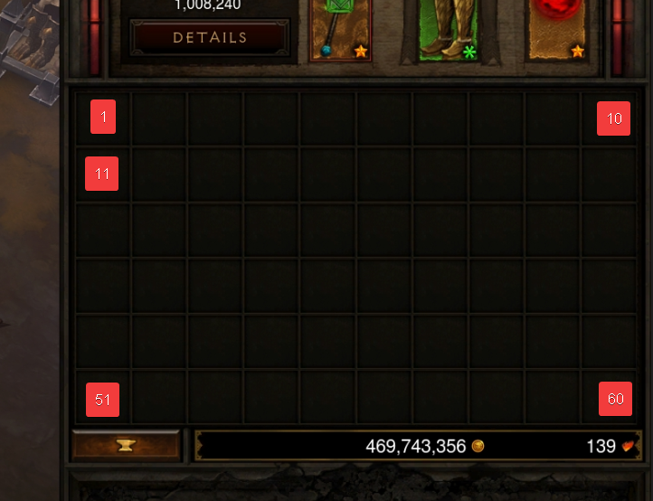

# D3keyHelper
[](https://opensource.org/licenses/MIT)

D3KeyHelper是一个有图形界面，可自定义配置的暗黑3鼠标宏工具。

项目主页：<https://github.com/Misaka10091/D3keyHelper>。当前由Misaka10091维护，原作者为Oldsand。

运行代码请使用AutoHotkey v1.1（不兼容v2），所有测试在v1.1.33.09版本下运行通过。

## 构建

安装包含Ahk2Exe的AutoHotkey v1.1后，在PowerShell中运行：

```powershell
.\scripts\build.cmd
```

默认产物为`dist\D3keyHelper.exe`和带文件版本号的ZIP，例如`dist\D3keyHelper-v1.4.2026.718-windows-x64.zip`。如果AutoHotkey安装在自定义目录，可显式指定编译器：

```powershell
.\scripts\build.cmd -CompilerPath "D:\Tools\AutoHotkey\Compiler\Ahk2Exe.exe"
```

推送到`main`、创建Pull Request或手动运行GitHub Actions中的`Build and Release`工作流，也会生成带版本号的可下载构建产物。

## 发布

发布tag支持三段语义化版本或四段Windows版本，例如`v1.5.0`或`v1.4.2026.718`。推送tag后，GitHub Actions会将tag版本注入应用显示版本和ProductVersion，生成同版本ZIP，并自动创建GitHub Release。Release只发布ZIP，EXE已包含在ZIP内；`settings.ini`和`profiles/`会在首次运行时自动生成，不放入发布包。三段tag的Windows FileVersion会按平台要求补零，例如`v1.5.0`对应`1.5.0.0`。

```powershell
git tag v1.5.0
git push origin v1.5.0
```

本地可以用相同参数验证发布构建：

```powershell
.\scripts\build.cmd -Version v1.5.0
```

## 目录结构

- `src/`：AutoHotkey源代码。
- `scripts/`：本地和CI构建脚本。
- `docs/images/`：README使用的界面截图。
- `dist/`：编译产物，不纳入版本控制。
- `settings.ini`和`profiles/`：程序自动生成的本机运行配置，不纳入版本控制。

## 主界面（完全模式）


## 主界面（紧凑模式）


1. 右上角设置战斗宏启动快捷键。可以为鼠标或者键盘按键。因为暗黑3的默认强制站立键为Shift，玩家在设置所有宏相关快捷键时应避免使用Shift键，以免出现bug！
2. 按键宏设置区域可以设置具体的战斗宏：
   1. 设置对应的技能快捷键，和游戏中一样除了鼠标左右键无法更改外其他都可以自定义。
   2. 设置对应按键的执行策略，目前支持的可能策略有：
      1. 按住该键不放（按住不放）。
      2. 固定时间间隔点击（连点）。
      3. 保持Buff模式（保持buff）。保持buff只能针对有绿条buff的技能，比如法师电盾，DH烟雾弹。宏会自动检测游戏分辨率并获取相关像素点的颜色信息，平时并不作为，只在buff快消失时点击续上buff。
   3. 设置具体各个策略的执行间隔，最少20毫秒，最多60秒运行一次。
   4. **1.4版本对延迟功能进行了重新设计，支持正负延迟，从而适配类似武僧火元灵，需要卡元素戒周期，且爆发有前戏的Build。**
3. 额外设置区域包含一些和可以继续提升游戏体验的辅助功能：
   1. 快速切换：设置一个按键快速切换到本配置。
      1. 切换后自动启动宏（开启后，以懒人模式启动的宏可以在运行过程中无缝切换）
   2. 走位辅助：可设置为强制站立，或者强制走位。
   3. 宏启动方式：
      1. 懒人模式（按一下开，再按一下关）。
      2. 仅按住时（字面意思）。
      3. 仅按一次（按下时自动按下所有“按住不放”的技能按键一次）。
   4. 使用单线程按键队列：开启后，因连点，保持buff所产生的按键不会立即按下，而是加入到一个按键队列中。连点会使得按键加入队列的头部，保持buff会加入队列的尾部。最后按键队列里的按键再按照固定的时间间隔一一发送至游戏。此功能主要配合冰吞使用，可以解决冰吞因为前后摇无法续上buff的问题。但是开启后会造成而外的按键延迟，非冰吞请勿开启。
   5. 快速暂停：按下对应鼠标键时可以短时间暂停压键。因为游戏本身设计中当有按键长按时会屏蔽鼠标左键。开启这项功能可以缓解无法点门，无法点祭坛的情况。
4. 右侧设置通用的辅助功能：
   1. 设置助手快捷键。程序会自动猜测用户的目的从而执行对应的策略。同时助手宏的启动方式和战斗宏的懒人模式类似，按一下开启，再按一下可以打断当前宏。
   2. 助手宏动画速度：可以调节鼠标移速，等待间隔。根据自身网络，电脑情况选择。
   3. 赌博助手（出现赌博界面时开启）：按下助手快捷键时即按下x次右键。
   4. 拾取助手（非战斗中，其他助手都没唤醒时开启）：若鼠标在人物附近，按下助手快捷键即按下x次左键，否则只按下一次左键。
   5. 分解助手（出现分解页面时开启）:
      1. 快速分解，按下即等于左键点击+自动回车。
      2. 一键分解，按下自动分解背包内所有能分解，不处在安全格中的物品。灰白蓝黄不受安全区域影响，无论如何都会被分解掉。
      3. 智能分解，和一键分解一样，但会跳过远古，神圣，太古。另有两个模式可以只留神圣，无形，太古。或者只留太古。
   6. 重铸助手（重铸页面打开时开启）：
      1. 重铸一次：重铸鼠标指针处的装备一次。
      2. 重铸直到远古，太古：不停重铸直到装备变为远古或者太古
      3. 不停重铸的最大重铸次数可以在“应用设置”中修改
   7. 升级助手（升级页面打开时开启）：自动升级背包内不在安全格区域内的黄色装备。
   8. 转化助手（转化页面打开时开启）：自动使用背包内非安全格内的装备转化材料。
   9.  使用快捷键切换配置成功时播放声音（字面意思）。
   10. 智能暂停：按下tab键时暂停宏，按下回车，回城（T），地图（M）时停止宏。

## 应用设置与 Profile

主界面的“应用设置”集中管理运行范围、按键发送模式、分辨率、Gamma、Buff刷新阈值、安全格、最大重铸次数和助手自定义速度。具有常用预设的项目使用可编辑下拉框，既能直接选择，也能输入自定义值。主界面的“保存”按钮会立即保存全局设置和所有Profile，右下角托盘菜单也提供相同入口。右上角“—”会保存设置并最小化到托盘；点击“×”会询问是退出程序、最小化到托盘，还是取消关闭操作。

Profile可以在应用设置中新增、重命名和删除，也可以点击主界面配置Tab右侧的“＋”快捷新增。程序启动时会自动加载`profiles/`目录下的全部INI文件，文件名就是Profile名称，不需要在全局配置中维护清单；目录为空时会自动创建`配置1.ini`、`配置2.ini`、`配置3.ini`和`配置4.ini`。`settings.ini`只保存全局设置，`activatedprofile`记录当前Profile的文件名。

“高级技能设置”用于配置每个技能的优先级、重复次数、重复间隔和按键触发键，不再需要手动编辑INI。

### 配置安全格

安全格中的物品不会受到一键宏影响。在应用设置中使用英文逗号分隔格子编号，留空表示不保护任何格子。具体编号与游戏背包格子的对应如下：



序列号默认为61、62、63。这三个格子并不存在，只用于保留旧版默认行为。

序列号的排序无所谓，关闭/退出后它们会被自动从小到大排序。

选择一键/智能分解并设置至少一个1-60的格子后，主界面会显示绿色的“安全格已设置”提示。

分享配置时，可以单独分享`profiles`目录中的任意INI文件；全量迁移时同时复制`settings.ini`和`profiles`目录。
